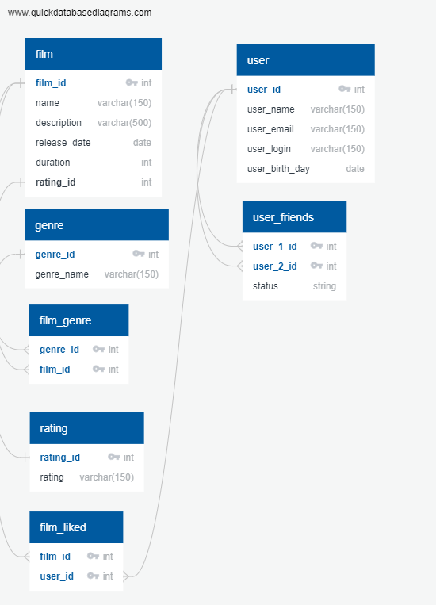

# java-filmorate
Template repository for Filmorate project.

[Диаграма](https://app.quickdatabasediagrams.com/#/d/EKuRox)

С таблицами user film и rating все понятно.  
А вот в остальных составной ключ, к примеру film_genre два первичных ключа хранящих один из возможных жанров фильма.  
В таблице film_liked такой же ключ, но без доп. полей, тут просто само наличие говорит о поставленном лайке если такой комбинации из id фильма и юзера нет значит и лайка нет.

  

**Примеры запросов:**  
_Топ 10 фильмов._

`SELECT f.name,`  
`COUNT(fl.user_id) likes`  
`FROM film AS f`  
`LEFT JOIN film_liked AS fl ON f.film_id = fl.film_id`  
`GROUP BY f.name`  
`ORDER BY likes`  
`LIMIT 10`;

_Общие друзья:_  
(Для примера айди друзей 1 и 2)

`SELECT user1_frinds common_friends`  
`FROM (SELECT uf1.user_2_id user1_frinds,`  
`uf2.user_2_id user2_friends`  
`FROM user_friends uf`  
`LEFT JOIN user_friends AS uf2 ON uf1.user_2_id = uf2.user_2_id`  
`WHERE uf1.user_1_id = 1`   
`AND uf2.user_1_id = 2)`  
`WHERE user1_frinds = user2_friends;
`

_Со всем списками друзей и фильмов и так понятно_
